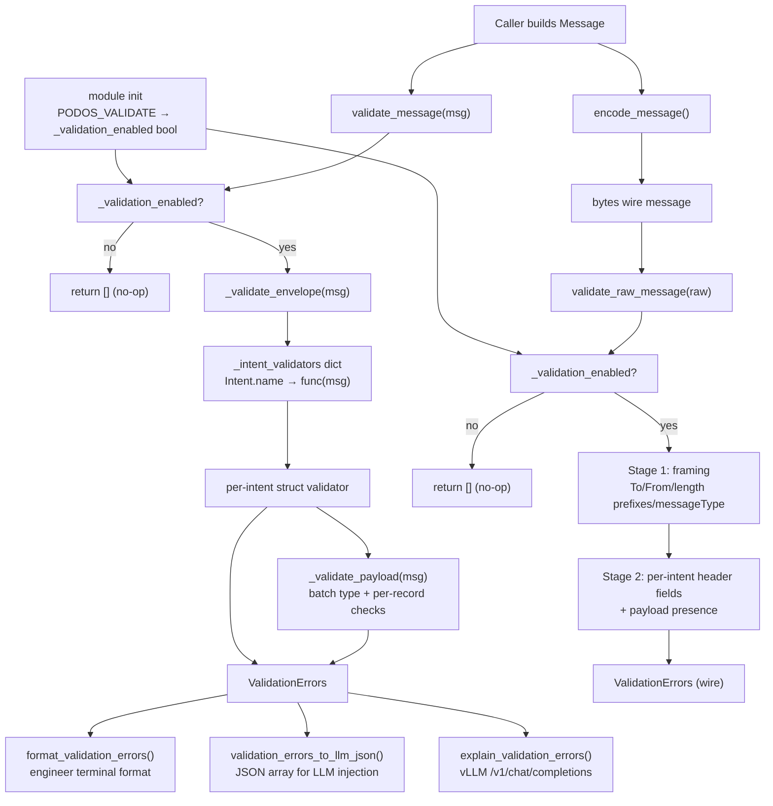

## Pod-OS Intent Field Validation — Python Client

The Python client includes a built-in validation layer in `pod_os_client/message/validate.py` that produces structured, dual-audience (engineer + LLM) errors for every Intent. Validation covers envelope requirements, per-Intent struct fields, NeuralMemory payload contents, and raw wire-format header correctness. Both `validate_message()` and `validate_raw_message()` are gated by an environment variable so they carry zero cost in production.

---

### Environment Gate

Validation is disabled by default. Enable it with the `PODOS_VALIDATE` environment variable:

```bash
export PODOS_VALIDATE=1        # enable (also accepts "true" or "yes")
unset PODOS_VALIDATE           # disable (default in production)
```

The variable is read **once at module import**. Both `validate_message()` and `validate_raw_message()` return an empty list immediately when disabled — the hot path is a single bool check with zero allocations.

```python
# pod_os_client/message/validate.py
import os
_v = os.environ.get("PODOS_VALIDATE", "").lower().strip()
_validation_enabled: bool = _v in ("1", "true", "yes")
```

---

### Error Types

Every violation is a `ValidationError` dataclass. A list of them is `ValidationErrors`.

```python
from pod_os_client.message.validate import ValidationError, ValidationErrors

@dataclass
class ValidationError:
    severity: str       # "error" or "warn"
    intent: str         # e.g. "LinkEvent"
    struct_path: str    # Python dot-path: "neural_memory.link.category"
    wire_field: str     # Wire protocol key: "category"
    rule: str           # "required", "one_of_required", "format", "nil_struct",
                        #  "header_missing", "header_value", "payload_type",
                        #  "payload_format", "uncovered"
    message: str        # Human-readable description
    fix: str            # Concrete remediation step
    example_code: str   # Minimal Python snippet showing a correct value
    references: list[str]  # Source file locations

ValidationErrors = list[ValidationError]
```

#### Engineer format

```python
from pod_os_client.message.validate import format_validation_errors

errs = msg.validate()
print(format_validation_errors(errs))
```

Output — one block per error, terminal-friendly:

```
[ERROR] LinkEvent / neural_memory.link.category (category): required
  What: neural_memory.link.category (category) is required for LinkEvent and is missing.
  Fix:  Set neural_memory.link.category to a non-empty relationship string.
  Code: msg.neural_memory.link.category = "related"
```

`[WARN]` prefix for warnings. Empty list produces `""`.

#### LLM format

```python
from pod_os_client.message.validate import validation_errors_to_llm_json

print(validation_errors_to_llm_json(errs))
```

Output — JSON array, one object per error, suitable for prompt injection:

```json
[{
  "severity": "error",
  "intent": "LinkEvent",
  "struct_path": "neural_memory.link.category",
  "wire_field": "category",
  "rule": "required",
  "description": "neural_memory.link.category (category) is required for LinkEvent and is missing.",
  "fix": "Set neural_memory.link.category to a non-empty string identifying the semantic relationship.",
  "example_code": "msg.neural_memory.link.category = \"related\"",
  "references": ["message/types.py:LinkFields.category", "message/header.py:_link_events_message_header"]
}]
```

---

### Struct-Level Validation — `validate_message(msg)`

Called as `msg.validate()` (monkey-patched onto `Message` at package init). Dispatches in three layers:

1. **Envelope** (all intents): `to`/`from_` format, `intent` present, `client_name` for GatewayId.
2. **Intent dispatch table** keyed by `msg.intent` (the `Intent.Name` string).
3. Per-intent private validator returning all violations at once (not just the first).

```python
from pod_os_client.message.validate import validate_message, format_validation_errors

errs = validate_message(msg)   # or: errs = msg.validate()
if errs:
    print(format_validation_errors(errs))
```

#### Nil-guard convention

All validators check the relevant top-level struct (`msg.event`, `msg.neural_memory`, `msg.neural_memory.link`, etc.) before dereferencing. A `None` struct produces a `Rule: "nil_struct"` error with a `Fix` directing the caller to initialize it.

---

### Per-Intent Validation Rules

#### Envelope (all intents)

| Struct path | Wire field | Rule |
|---|---|---|
| `Envelope.to` | `to` | required; `name@gateway` format |
| `Envelope.from_` | `from` | required; `name@gateway` format |
| `Envelope.intent` | — | required; non-empty string |
| `Envelope.client_name` | `id:name` | required for GatewayId only |
| `Envelope.message_id` | `_msg_id` | optional |

---

#### StoreEvent

| Struct path | Wire field | Rule |
|---|---|---|
| `event` | — | required; nil_struct if None |
| `event.owner` / `event.owner_unique_id` | `owner` / `owner_unique_id` | one_of_required |
| `event.location` | `loc` | required |
| `event.location_separator` | `loc_delim` | required |
| `event.unique_id` | `unique_id` | optional |
| `event.id` | `event_id` | optional |
| `event.timestamp` | `timestamp` | auto-generated if empty (warn) |
| `event.type` | `type` | optional; defaults to `"store event"` |
| `payload.mime_type` | `mime` | optional |
| `message_id` | `_msg_id` | optional |

Wire format: `_db_cmd=store\t…\t_msg_id=<uuid>` — `_msg_id` is the **last field and has no trailing tab**.

---

#### StoreBatchEvents

| Struct path | Wire field | Rule |
|---|---|---|
| `neural_memory.batch_events` | payload | required; `list[BatchEventSpec]` |
| `message_id` | `_msg_id` | optional |

Per-record `BatchEventSpec` requirements: `event.timestamp`, `event.owner` or `event.owner_unique_id`, `event.location`, `event.location_separator`.

Wire format: `_db_cmd=store_batch\t_msg_id=<uuid>\t` — **every field including `_msg_id` carries a trailing tab**. This is the canonical encoding for `StoreBatchEvents` (and differs from all other intents). Use `format_batch_events_payload()` to build the payload.

```python
from pod_os_client.message.encoder import format_batch_events_payload
from pod_os_client.message.types import BatchEventSpec, EventFields

payload = format_batch_events_payload([
    BatchEventSpec(
        event=EventFields(
            unique_id=str(uuid4()),
            owner="$sys",
            timestamp=get_timestamp(),
            location="TERRA|47.6|-122.5",
            location_separator="|",
        )
    )
])
```

---

#### StoreBatchTags

| Struct path | Wire field | Rule |
|---|---|---|
| `event` | — | required; nil_struct if None |
| `event.id` / `event.unique_id` | `event_id` / `unique_id` | one_of_required |
| `event.owner` / `event.owner_unique_id` | `owner` / `owner_unique_id` | one_of_required |
| `neural_memory.tags` | payload | required; `list[Tag]` with `tag.key` and `tag.value` non-None |
| `message_id` | `_msg_id` | optional |

---

#### GetEvent

| Struct path | Wire field | Rule |
|---|---|---|
| `event` | — | required; nil_struct if None |
| `event.id` / `event.unique_id` | `event_id` / `unique_id` | one_of_required |
| `neural_memory.get_event.send_data` | `send_data=Y` | optional boolean flag |
| `neural_memory.get_event.local_id_only` | `local_id_only=Y` | optional boolean flag |
| `neural_memory.get_event.get_tags` | `get_tags=Y` | optional boolean flag |
| `neural_memory.get_event.get_links` | `get_links=Y` | optional boolean flag |
| `neural_memory.get_event.get_link_tags` | `get_link_tags=Y` | optional boolean flag |
| `neural_memory.get_event.get_target_tags` | `get_target_tags=Y` | optional boolean flag |
| `neural_memory.get_event.event_facet_filter` | `event_facet_filter` | optional |
| `neural_memory.get_event.link_facet_filter` | `link_facet_filter` | optional |
| `neural_memory.get_event.target_facet_filter` | `target_facet_filter` | optional |
| `neural_memory.get_event.category_filter` | `category_filter` | optional |
| `neural_memory.get_event.tag_filter` | `tag_filter` | optional |
| `neural_memory.get_event.tag_format` | `tag_format` | always written; defaults to `0` if `None` |
| `neural_memory.get_event.request_format` | `request_format` | always written; defaults to `0` |
| `neural_memory.get_event.first_link` | `first_link` | optional; written when `> 0` |
| `neural_memory.get_event.link_count` | `link_count` | optional; written when `> 0` |
| `message_id` | `_msg_id` | optional; last field, no trailing tab |

---

#### GetEventsForTags

| Struct path | Wire field | Rule |
|---|---|---|
| `neural_memory` | — | required; nil_struct if None |
| `neural_memory.get_events_for_tags` | — | required; nil_struct if None |
| `neural_memory.get_events_for_tags.buffer_results` | `buffer_results` | always written as `Y` or `N` |
| `neural_memory.get_events_for_tags.buffer_format` | `buffer_format` | always written; defaults to `"0"` |
| `neural_memory.get_events_for_tags.event_pattern` | `event` | optional |
| `neural_memory.get_events_for_tags.event_pattern_high` | `event_high` | optional |
| `neural_memory.get_events_for_tags.link_tag_filter` | `link_tag_pattern` | optional (**wire field is `link_tag_pattern`, not `link_tag_filter`**) |
| `neural_memory.get_events_for_tags.linked_events_filter` | `linked_events_tag_filter` | optional |
| `neural_memory.get_events_for_tags.owner` | `owner` | optional |
| `neural_memory.get_events_for_tags.owner_unique_id` | `owner_unique_id` | optional (if owner empty) |
| `neural_memory.get_events_for_tags.get_event_object_count` | `get_eo_count=Y` | optional boolean flag |
| `neural_memory.get_events_for_tags.include_tag_stats` | `include_tag_stats=Y` | optional boolean flag |
| `neural_memory.get_events_for_tags.invert_hit_tag_filter` | `invert_hit_tag_filter=Y` | optional boolean flag |
| `neural_memory.get_events_for_tags.hit_tag_filter` | `hit_tag_filter` | optional |
| `message_id` | `_msg_id` | optional; last field, no trailing tab |

Note: `msg.event` is **not** required and **not** dereferenced by `_get_events_for_tag_message_header`.

---

#### LinkEvent

| Struct path | Wire field | Rule |
|---|---|---|
| `neural_memory` | — | required; nil_struct if None |
| `neural_memory.link` | — | required; nil_struct if None |
| `neural_memory.link.event_a` + `event_b` **OR** `unique_id_a` + `unique_id_b` | `event_id_a`/`event_id_b` **or** `unique_id_a`/`unique_id_b` | one pair required |
| `neural_memory.link.category` | `category` | required |
| `neural_memory.link.strength_a` | `strength_a` | required; non-zero float |
| `neural_memory.link.strength_b` | `strength_b` | required; non-zero float |
| `neural_memory.link.timestamp` | `timestamp` | required; POSIX microseconds string |
| `neural_memory.link.owner_event_id` / `owner_unique_id` | `owner_event_id` / `owner_unique_id` | one_of_required |
| `neural_memory.link.location` | `loc` | required |
| `neural_memory.link.location_separator` | `loc_delim` | required |
| `neural_memory.link.type` | `type` | optional |
| `neural_memory.link.id` | `event_id` | optional |
| `neural_memory.link.unique_id` | `unique_id` | optional |
| `event.id` / `event.unique_id` / `event.owner` | `event_id` / `unique_id` / `owner` | optional; identify the link-creation event object |
| `message_id` | `_msg_id` | optional (mid-header position) |
| `payload.mime_type` | `mime` | optional |

Wire format: **every field carries a trailing tab** including `_msg_id` and the final `owner_event_id`/`owner_unique_id` field. Use `"".join(parts)` with each part pre-suffixed with `\t`.

---

#### UnlinkEvent

| Struct path | Wire field | Rule |
|---|---|---|
| `neural_memory` | — | required; nil_struct if None |
| `neural_memory.link` | — | required; nil_struct if None |
| `neural_memory.link.id` / `neural_memory.link.unique_id` | `event_id` / `unique_id` | one_of_required |
| `neural_memory.link.owner` | `owner` | optional |
| `neural_memory.link.location` | `loc` | optional |
| `neural_memory.link.location_separator` | `loc_delim` | optional; required when `location` is set |
| `neural_memory.link.timestamp` | `timestamp` | optional |
| `message_id` | `_msg_id` | optional |

Wire format: **every field carries a trailing tab** including `_msg_id`. Use `"".join(parts)` with each part pre-suffixed with `\t`.

---

#### StoreBatchLinks

| Struct path | Wire field | Rule |
|---|---|---|
| `neural_memory` | — | required; nil_struct if None |
| `neural_memory.batch_links` | payload | required; non-empty `list[BatchLinkEventSpec]` |
| `message_id` | `_msg_id` | optional |

Per-record `BatchLinkEventSpec` requirements:

| Struct path | Wire field | Rule |
|---|---|---|
| `event.timestamp` | `timestamp` | required |
| `event.owner` / `event.owner_unique_id` | `owner` / `owner_unique_id` | one_of_required |
| `event.location` | `loc` | required |
| `event.location_separator` | `loc_delim` | required |
| `link.timestamp` | `timestamp` | required; **NOT auto-generated**; must be set by caller |
| `link.event_a`+`event_b` OR `link.unique_id_a`+`unique_id_b` | `event_id_a`/`event_id_b` or `unique_id_a`/`unique_id_b` | one pair required |
| `link.category` | `category` | required |
| `link.strength_a` | `strength_a` | required; non-zero float |
| `link.strength_b` | `strength_b` | required; non-zero float |
| `link.owner_event_id` / `link.owner_unique_id` | `owner_event_id` / `owner_unique_id` | one_of_required |
| `link.location` | `loc` | required |
| `link.location_separator` | `loc_delim` | required |

Use `format_batch_link_events_payload()` to build the payload.

---

#### GatewayId

| Struct path | Wire field | Rule |
|---|---|---|
| `client_name` | `id:name` | required |
| `user_name` | `id:user` | required when `passcode` is set |
| `passcode` | `id:passcode` | required when `user_name` is set |
| `message_id` | `_msg_id` | optional; last field, **no trailing tab** |

Wire format note: `id:name` and `id:user`/`id:passcode` fields carry a trailing tab; `_msg_id` does **not**.

---

#### GatewayStreamOn / GatewayStreamOff

No required struct fields beyond envelope. `message_id` → `_msg_id` optional.

---

#### ActorRequest

`_type=status` is always written by the encoder. No required struct fields beyond envelope. `message_id` → `_msg_id` optional.

Wire format note: `_type=status\t` carries a trailing tab; `_msg_id` does not.

---

#### ActorResponse / Status

No required struct fields beyond envelope. `response.status`, `response.message`, `event.type`, `event.owner`, `payload.mime_type`, `message_id` are all optional.

---

#### ActorReport

| Struct path | Wire field | Rule |
|---|---|---|
| `response` | — | required; nil_struct if None |
| `response.status` | `_status` | required |
| `response.message` | `_msg` | required |
| `message_id` | `_msg_id` | optional |

---

#### Response intents (`*Response` suffix, decoded not sent)

All response intents (`StoreEventResponse`, `StoreBatchEventsResponse`, `StoreBatchTagsResponse`, `GetEventResponse`, `GetEventsForTagsResponse`, `LinkEventResponse`, `UnlinkEventResponse`, `StoreBatchLinksResponse`):

- `response` non-None (WARN if None — decoder should have populated it)
- `response.status` non-empty (WARN if missing)

---

### Wire Trailer Tab Rule

The Pod-OS wire protocol uses `strings.Builder` + explicit `\t` suffix per field. The Python encoding must match **exactly**. Three header builders carry trailing tabs on every field including the last:

| Header builder | Trailing tab on `_msg_id`? | Python impl |
|---|---|---|
| `_store_batch_events_message_header` | **Yes** (also on `_db_cmd`) | `"".join(parts)` with each part `= "field=value\t"` |
| `_link_events_message_header` | **Yes** (mid-header position) | `"".join(parts)` with each part `= "field=value\t"` |
| `_unlink_events_message_header` | **Yes** | `"".join(parts)` with each part `= "field=value\t"` |
| All other header builders | No (last field has no `\t`) | `"\t".join(parts)` |

A 1-byte mismatch here causes the server to misalign the header/payload boundary, producing truncated or corrupted messages. Do **not** use `"\t".join()` for these three functions.

---

### Wire Validation — `validate_raw_message(raw)`

```python
from pod_os_client.message.validate import validate_raw_message, format_validation_errors

errs = validate_raw_message(raw_bytes)
if errs:
    print(format_validation_errors(errs))
```

**Stage 1 — framing and To/From validation:**

- `raw` is `None` → `Rule: "nil_struct"` error, return immediately
- `len(raw) < 63` → `Rule: "format"` (too short for 7 × 9-byte prefix fields)
- `len(raw) > MAX_MESSAGE_SIZE` → `Rule: "format"` (too large)
- Parse 7 × 9-byte length prefix fields (`totalLength`, `toLength`, `fromLength`, `headerLength`, `messageType`, `dataType`, `payloadDataLength`); each parse failure → `Rule: "format"`
- `to` and `from` must be non-empty and match `name@gateway` format → `Rule: "format"`
- `messageType` must match a known `Intent.message_type` → `Rule: "format"`

**Stage 2 — per-intent header field validation:**

Header string is extracted and parsed into `dict[str, str]`. Per-messageType checks:

| messageType | Command / Intent | Checks |
|---|---|---|
| 1000 | NeuralMemory request | `_db_cmd` present and a known command; then command-specific checks below |
| 1001 | NeuralMemory response | `_status` (WARN if absent); command-specific response checks |
| 5 | GatewayId | `id:name` present and non-empty |
| 2 | ActorEcho | `_msg_id` present and non-empty (WARN if absent) |
| 4 | ActorRequest | `_type=status` present |
| 9, 10 | GatewayStreamOff/On | No required header fields |
| 3, 19, 30 | Status / ActorReport / ActorResponse | No required header fields |

Per `_db_cmd` header checks (messageType 1000):

| `_db_cmd` | Required header fields |
|---|---|
| `store` | `timestamp` (WARN if absent) |
| `store_batch` | payload length `> 0` |
| `tag_store_batch` | `event_id` or `unique_id`; `owner` or `owner_unique_id` |
| `get` | `event_id` or `unique_id` |
| `events_for_tag` | `buffer_results` (WARN if absent) |
| `link` | `strength_a`, `strength_b`, `category`, `timestamp`, `owner_event_id` or `owner_unique_id`, event ID pair |
| `unlink` | `event_id` or `unique_id` |
| `link_batch` | payload length `> 0` |

Response header checks (messageType 1001, keyed by `_type` / `_command` / `_db_cmd`):

| Command | Required response header fields |
|---|---|
| `get` | `_event_id` or `event_id` |
| `link` | `link_event` |
| `store`, `store_batch`, `tag_store_batch` | `_count` |
| `link_batch` | `_links_ok` |

---

### AI-Assisted Remediation — `explain_validation_errors()`

```python
from pod_os_client.message.validate import explain_validation_errors

explanation, err = explain_validation_errors(
    errs,
    endpoint="http://localhost:8000",
    model="meta-llama/Llama-3.1-8B-Instruct",
)
if err is None:
    print(explanation)
```

The endpoint must implement the OpenAI-compatible `/v1/chat/completions` interface. Returns `("", None)` when validation is disabled or `errs` is empty. Each error is sent as a separate chat completion; results are joined with `\n\n`.

Prompt template per error:

```
You are a Pod-OS Python client expert. A message validation error occurred.

Intent: {intent}
Struct Path: {struct_path}
Wire Field: {wire_field}
Rule Violated: {rule}
Description: {message}
Suggested Fix: {fix}
Example Code: {example_code}
Source References: {", ".join(references)}

Task: Provide corrected Python code for this message construction. Show all required fields
for the {intent} intent. If multiple valid approaches exist (e.g. event_a/event_b vs
unique_id_a/unique_id_b), show both. Use only types from the message package.
```

---

### Integration Pattern

```python
import os
os.environ["PODOS_VALIDATE"] = "1"   # set before first import; or use shell env

from pod_os_client.message.validate import (
    validate_message,
    validate_raw_message,
    format_validation_errors,
    validation_errors_to_llm_json,
    explain_validation_errors,
)

# Pre-send validation
errs = validate_message(msg)          # or: msg.validate()
if errs:
    print(format_validation_errors(errs))     # engineer
    print(validation_errors_to_llm_json(errs))  # LLM / structured log
    # optional AI remediation (requires running vLLM endpoint)
    explanation, _ = explain_validation_errors(errs, "http://localhost:8000")
    print(explanation)
    raise ValueError("Message failed validation")

raw = encode_message(msg, connection_uuid)

# Wire validation on receipt (same env gate controls both)
wire_errs = validate_raw_message(raw)
if wire_errs:
    print(format_validation_errors(wire_errs))
```

---

### Architecture



---

### Source Locations

| File | Role |
|---|---|
| `pod_os_client/message/validate.py` | All validation logic: types, envelope, per-intent, wire, vLLM |
| `pod_os_client/message/header.py` | Header builders; critical for wire-format tab conventions |
| `pod_os_client/message/encoder.py` | `encode_message()`, `format_batch_events_payload()`, `format_batch_link_events_payload()` |
| `pod_os_client/message/types.py` | `Message`, `EventFields`, `LinkFields`, `NeuralMemoryFields`, `BatchEventSpec`, `BatchLinkEventSpec`, `Tag` |
| `pod_os_client/message/intents.py` | `IntentType` enum with `name`, `message_type`, `neural_memory_command` |
| `tests/test_validate.py` | 115 tests covering env gate, envelope, per-intent, wire Stage 1/2, format helpers |

---

### Currently Uncovered Intents

The following intents receive **envelope-only** validation (no per-intent struct checks):

**P0 next:**
`AuthAddUser`, `AuthUpdateUser`, `AuthUserList`, `AuthDisableUser`

**P1 fast follow:**
`ActorEcho`, `ActorHalt`, `ActorStart`, `GatewayDisconnect`, `GatewaySendNext`, `GatewayNoSend`, `GatewayStatus`, `ActorRecord`, `GatewayBatchStart`, `GatewayBatchEnd`, `QueueNextRequest`, `QueueAllRequest`, `QueueCountRequest`, `QueueEmpty`, `Keepalive`, `ReportRequest`, `InformationReport`, `ActorUser`, `RouteAnyMessage`, `RouteUserOnlyMessage`

For uncovered messageTypes, `validate_raw_message()` returns a `Severity: "warn", Rule: "uncovered"` error and stops further validation for that message.
